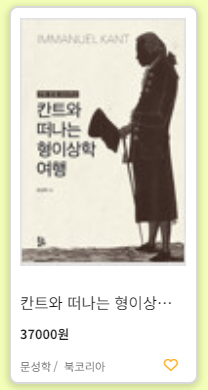
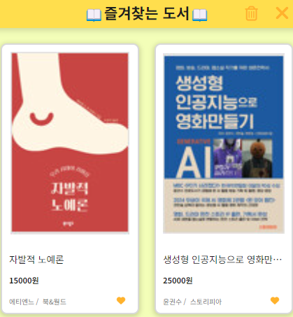

# 프로젝트명

BOOKBOOK 프로젝트는 알라딘 오픈 API를 활용해 검색 기능을 구현한 Front-End 프로젝트입니다.

## 설치 및 실행 방법

프로젝트를 설치하고 실행하는 방법에 대해 설명하세요.

1. 프로젝트를 클론합니다.
2. back-end, front-end에서 각각 필요한 의존성을 설치합니다. (각 폴더에서 npm install 해주기)
3. 알라딘 TTB KEY를 발급받아 back-end의 .env 파일에 다음과 같이 추가합니다.

   ```
   # 추가해야 할 .env 파일 내용

   API_URL = http://www.aladin.co.kr/ttb/api/
   API_TTB = 발급받은 TTB KEY
   ```

4. back-end 실행하기
   1. back-end 폴더에서 터미널에 `nodemon .\index.js` 실행
   2. front-end 폴더에서 `npm run dev` 실행

## 검색 기능


위 input에 원하는 도서를 검색하여 찾을 수 있습니다.

우측 하트 버튼을 누르면 찜한 도서 목록이 나옵니다.

## 찜 기능



카드의 우측 하단 하트 버튼을 눌러 찜 등록 및 해제를 할 수 있습니다.

## 즐겨찾는 도서 모달



모달에서도 찜 해제 및 재등록이 가능합니다.

휴지통 버튼을 누르면 찜한 도서를 모두 지우겠냐는 확인 메시지가 뜨고, 확인을 누를 시 찜 목록이 비워집니다.
하여 변경 사항을 제안합니다.
